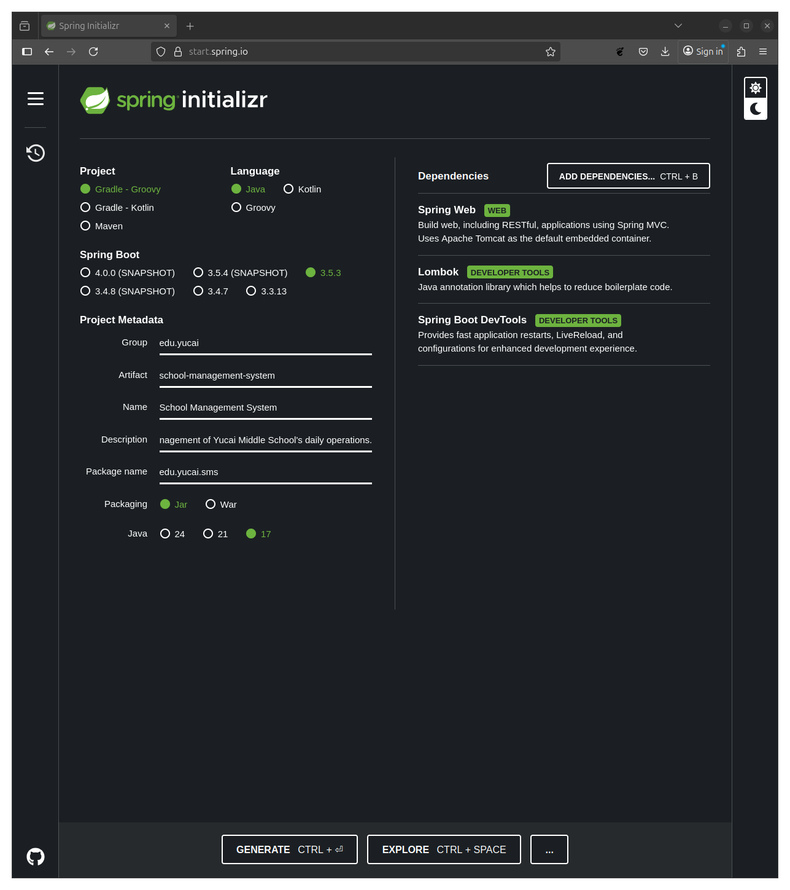
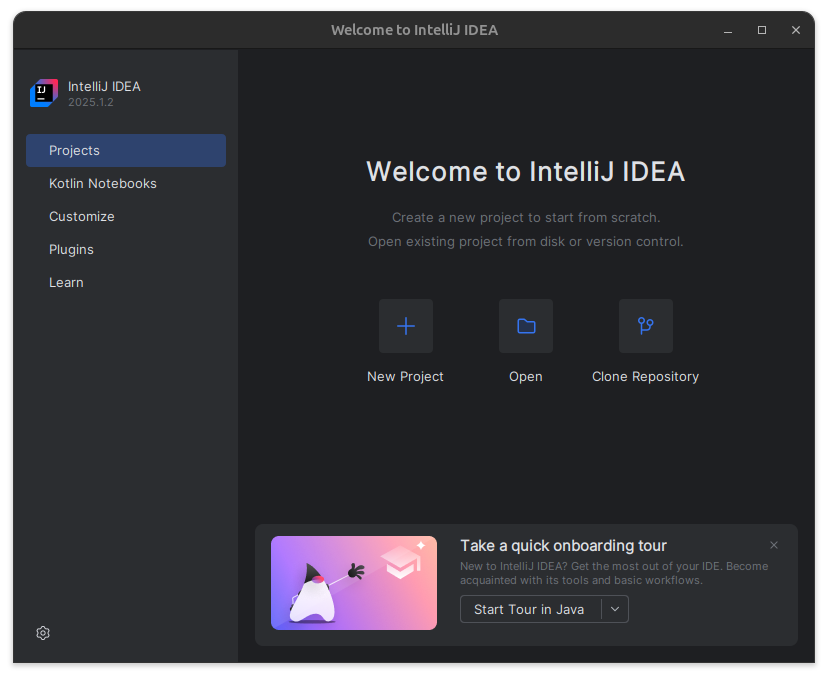
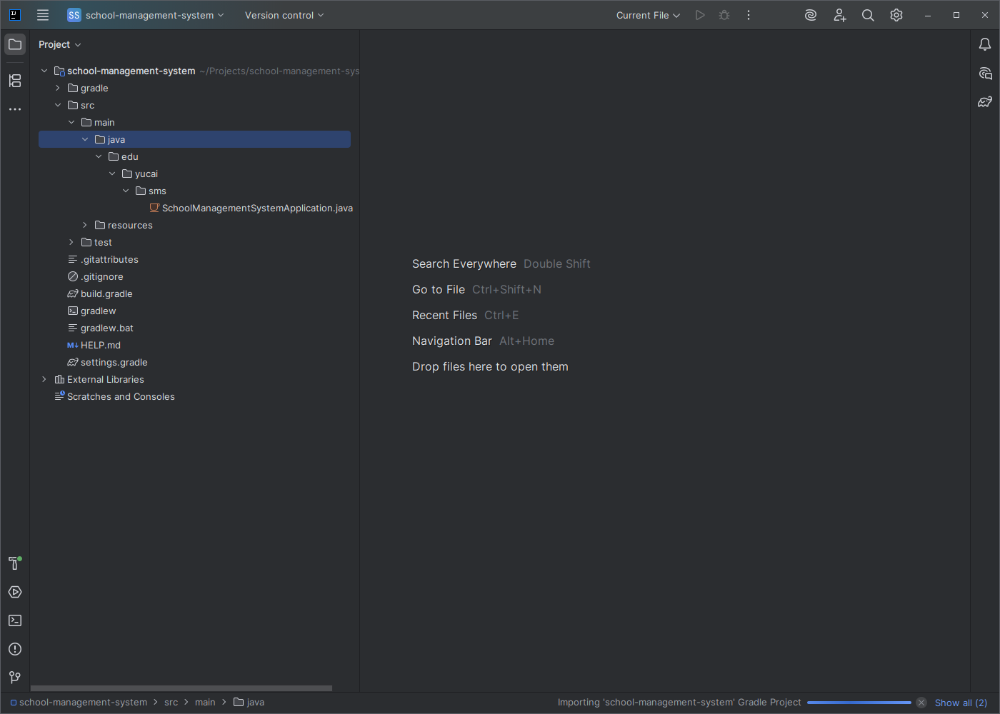
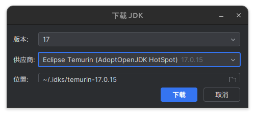
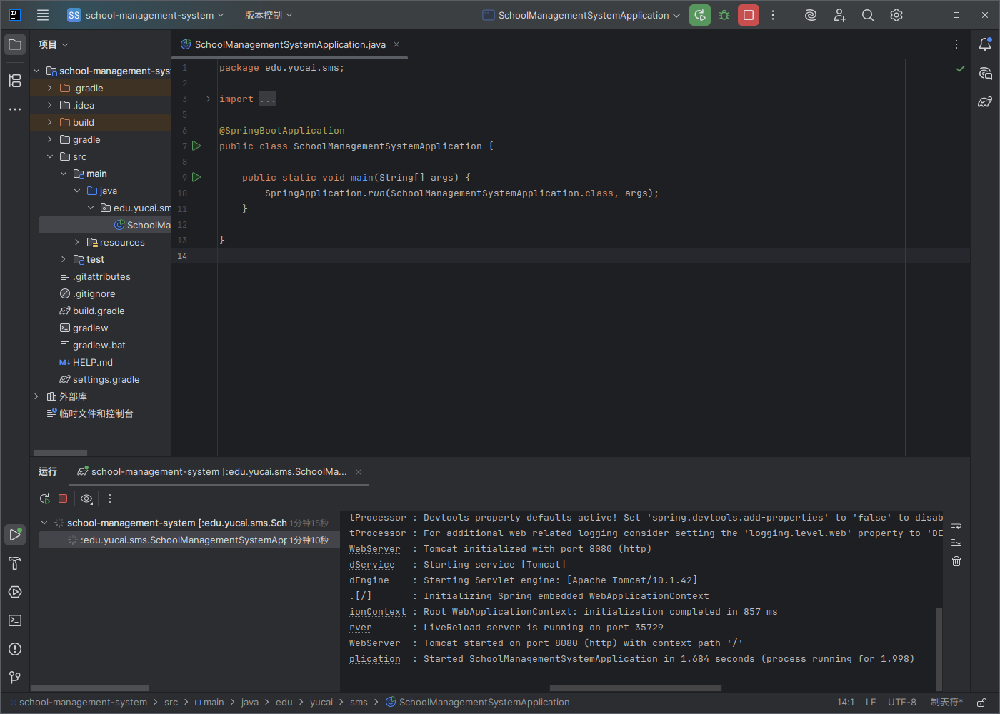

# 五分钟搭建第一个 Spring 项目

面对校长的需求，你现在要做的第一件事情是如何创建一个项目，后面有我一步一步教你操作，事情就会变得简单。

接下来，我会向你介绍：

- 使用 Spring Initializr 在线生成器创建项目
- 安装并使用 IntelliJ IDEA 导入项目
- 理解项目结构与启动流程

## 使用 Spring Initializr 在线生成器创建项目

俗话说，万事开头难，但是对于创建项目来说，这并不困难，我们可以使用[Spring Initializr](https://start.spring.io/)这个网站快速创建 Spring 项目。

Spring Initializr 的网页包含 5 个部分，分别是:

- Project
- Language
- Spring Boot
- Project Metadata
- Dependencies

现在你还不需要关心 Project、Language、Spring Boot，这几项保持默认就好，我们只需要修改 Project Metadata 和 Dependencies。

### Project Metadata

Project Metadata 是项目的基本信息，其中包含:

- Group
- Artifact
- Name
- Description
- Package name
- Packaging
- Java

Group 是工作组，说明当前这个项目的开发人员是谁，使用单词用点连接。我们要开发的是校务管理系统，可以使用`edu.yucai`。edu 表示教育，yucai 是学校的名字，表示这个系统是由育才中学开发的。

Artifact 是产物的名字，也就是项目最终打包之后的文件名，我们可以使用`school-management-system`表示校务管理系统。

Name 表示这个项目的名字，我们使用`School Management System`就可以了。

Description 表示项目的描述，我们可以使用`The School Administration System is used for digital management of Yucai Middle School's daily operations.`，当然你也可以直接写中文`这套校务管理系统用于管理育才中学的日常工作`。

Package Name 表示包名，这个概念不太好解释，你暂且使用`edu.yucai.sms`就可以了，sms 是`school-management-system`的缩写。

Packaging 表示打包方式，Java 表示选择的 Java 版本，我们保持默认就可以了。

接下来我们需要点击 ADD DEPENDENCIES 按钮添加我们需要的依赖，如果你对 Spring 的依赖还不是很了解，只需要跟我选择一样的就可以了。我选择了 3 项依赖以开始这个项目，分别是：

- Spring Web
- Lombok
- Spring Boot DevTools

在后面的章节中我会向你解释这三个依赖的作用，现在你只需要按照我的步骤做就可以了。

然后我们可以点击 GENERATE 按钮创建并下载这个项目，这样你就创建好你的第一个项目了。接下来我将向你展示如何打开并运行你的第一个项目。

## 使用 IntelliJ IDEA 导入并启动项目

在上一小节中，我们已经创建并下载了项目，这是一个 zip 文件，我们需要打开并执行这个项目，然后才能展开后面的工作。

我推荐你使用`jetbrains`公司开发的`IntelliJ IDEA`软件开发你的项目，并且这款软件有社区版本可以使用，足以完成你的工作了，当然如果你需要专业版的功能，你也可以选择购买专业版使用。

点击[IntelliJ IDEA](https://www.jetbrains.com/idea/)的连接，然后点击`Download`按钮下载，选择你需要的版本进行下载并安装。

需要注意的是，第一个选项 Ultimate 下载的是专业版本，第二个选项 Community 下载的是社区版。

如果你使用的是 Windows 电脑，下载完成后只需要执行下载后的文件安装就可以了。

首先我们需要将上一节中下载的项目解压，随后我们打开 Intellij IDEA 软件，点击 Open 打开我们创建的项目。

软件会询问你是否要信任打开的项目，点击信任项目(Trust Project)就可以了。这时我们需要等待片刻，因为软件正在分析我们的项目，并进行一些分析工作。

如果你不习惯使用英文，可以将软件的语言切换为中文。点击右上角的齿轮，点击 Setting，然后搜索 Chinese，搜索结果中将包含`Language and Region`，点击之后，将 Language 栏中的 English 改为 Chinese，然后点击 OK。软件会提示需要重启，点击 Restart 按钮，等待程序重启。如果程序没有自动重启，重新打开就可以了。

## 理解项目结构与启动流程

如果你看到右下角导入项目很慢，这是因为项目需要使用到 gradle 环境，而这个环境在国内访问很慢，甚至会频繁失败。我们可以修改项目的配置，让`IntelliJ IDEA`从国内的网站下载 gradle。

点击左侧文件列表中的`gradle/wrapper/gradle-wrapper.properties`,然后将 distributionUrl 配置项从`https\://services.gradle.org/distributions/gradle-8.14.2-bin.zip`改为`https\://mirrors.aliyun.com/gradle/distributions/v8.14.2/gradle-8.14.2-bin.zip`。后者是阿里云在国内的镜像地址，你可以参考[阿里云](https://developer.aliyun.com/mirror/gradle/?spm=a2c6h.25603864.0.0.27065857P3wCOd)官方的说明。

为了运行我们的第一个项目，我们还需要在电脑上安装 Java 运行环境，好在`IntelliJ IDEA`已经给我提供了便捷的安装方法。只需要点击右上角的齿轮，选择项目结构，然后点击左侧目录中的 SDK，这里面列出的就是你的电脑上已经安装的 JAVA SDK，如果列表是空的，说明你还没有安装任何 SDK。点击列表左上方的加号，并点击下载 JDK，打开下载页面。

你可以下载默认的 JDK 使用。对于我们的项目，我推荐使用 17 版本的 JDK 就可以了，供应商推荐使用 Eclipse Temurin。当然你也可以选择更高版本的 JDK，这对后面项目的开展不会有太大的影响。

随后我们就可以运行我们的项目了，找到`src`目录下的`java/edu/yucai/sms/SchoolManagementSystemApplication.java`,右键点击这个文件，然后点击运行`SchoolManageme...main()`就可以启动程序了。

我们会看到软件正在编译我们的程序，随后将我们的程序启动，这时不会发生任何事情，因为我们还没有开发我们的项目，所以我们的程序什么事情都不会干。

拖动日志窗口的滚动条，你可以看到程序输出了类似这样的一行文字`Started SchoolManagementSystemApplication in 1.684 seconds (process running for 1.998)`，这表示我们的程序已经成功启动了，现在点击右上角的红色矩形停止程序。

带着成功的喜悦，现在我们来看看我们创建的项目到底包含哪些东西，我只会作简单的介绍，你不需要试图搞懂所有的细节。

首先，我们项目包含一个 src 目录，这里面就是我们项目的源代码，包含 main 和 test 两个模块，分别用于执行源代码和用于测试的源代码，main 和 test 的结构基本上是一样的。main 中包含 java 目录，表示我们的代码是用 java 编写的，里面包含一个 edu.yucai.sms 的包，这就是我们创建项目时使用的包名，里面只有一个代码文件，也就是 SchoolManagementSystemApplication。我们可以打开这个文件观察，现在你不需要试图搞懂这个文件都写了些什么，随后我会向你讲解。和 java 目录并列的是 resources 目录，这里面包含一个 application.properties 文件，这里面包含我们可以使用程序读取的配置项，未来我们也会在这个文件中添加自定义的配置。

另外在根目录还有一个 build.gradle 文件，这个文件是我们整个项目的配置文件，他是用来描述我们这个项目的，比如使用的开发语言、框架以及依赖，打开这个文件，你可以看到我们在之前配置的组名和依赖都在这里面。
