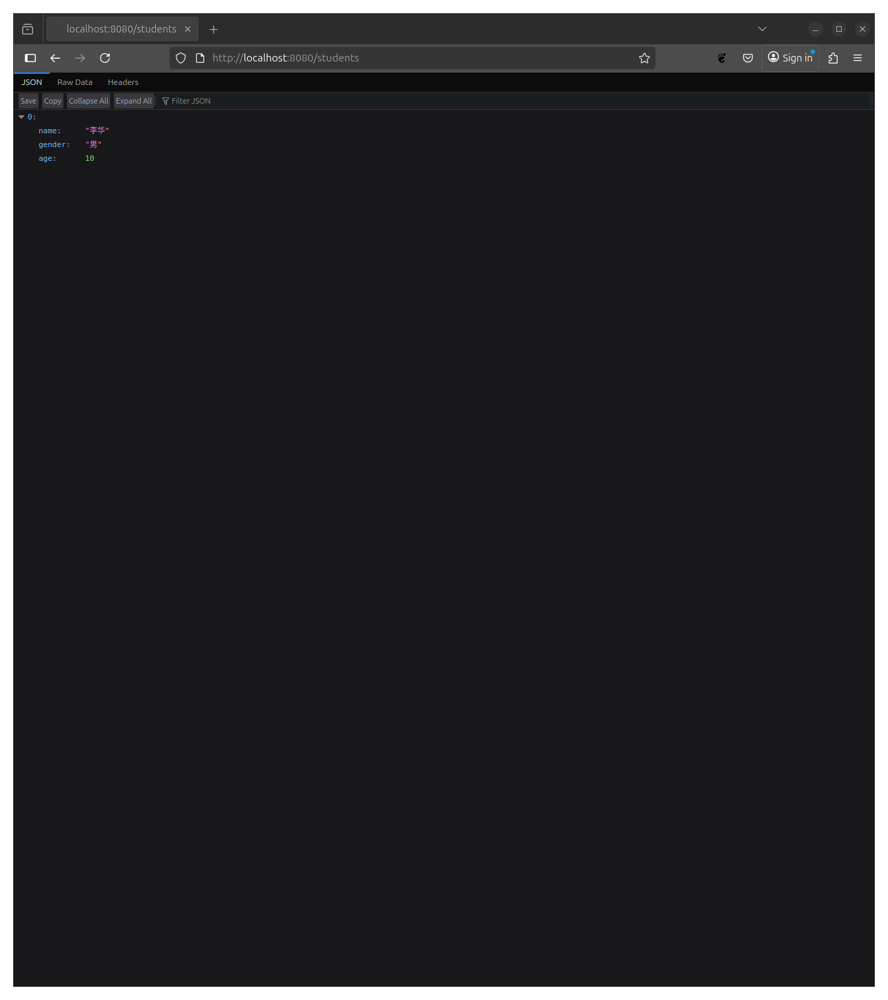
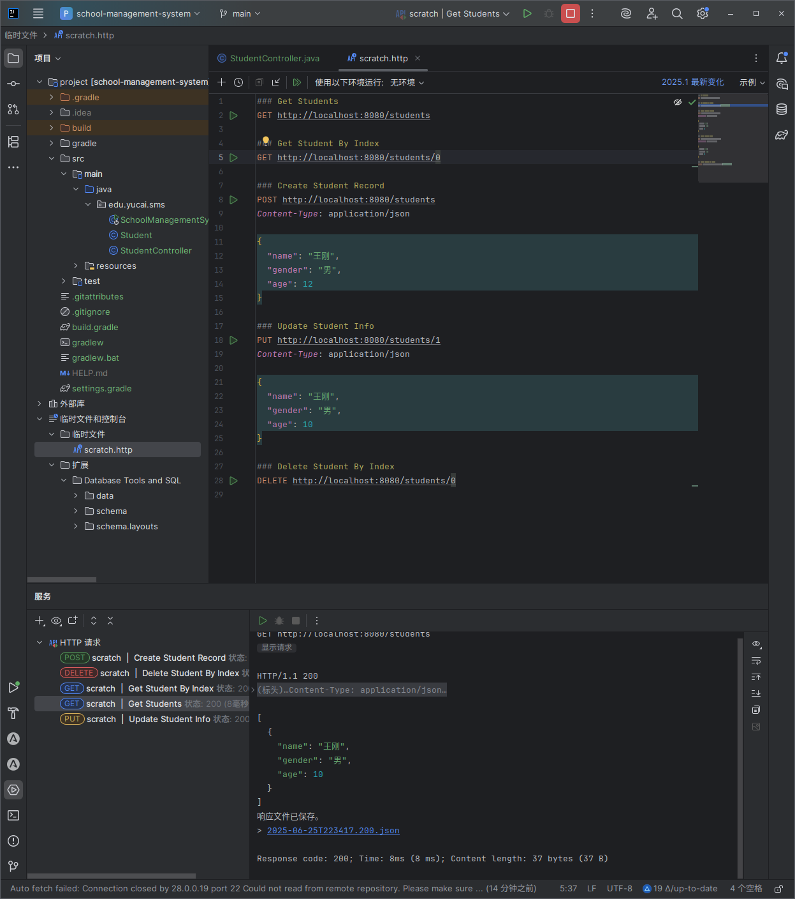

# 创建第一个服务器接口

上一章中我们已经创建好了一个 Spring 项目，但是要实现校长的需求应该从那里开始呢？对于一个校务管理系统，首先可以想到的是实现学生信息的管理，那么让我们先创建学生信息管理的接口吧。

## 创建第一个接口

要创建管理学生的接口，首先需要创建描述学生的代码，在 Java 中可以创建一个 Class 来描述学生的信息。于是在`edu.yucai.sms`包下面点击右键创建我们的第一个 Java 类。

我们创建了一个名字叫做 Student 的 Class。在项目的初期为了尽可能的简单，我们创建的学生信息只包含必要的信息，包括姓名、性别、年龄。

```java
package edu.yucai.sms;

public class Student {
    private String name;
    private String gender;
    private Integer age;

    public String getName() {
        return name;
    }

    public void setName(String name) {
        this.name = name;
    }

    public String getGender() {
        return gender;
    }

    public void setGender(String gender) {
        this.gender = gender;
    }

    public Integer getAge() {
        return age;
    }

    public void setAge(Integer age) {
        this.age = age;
    }

    public Student() {
    }

    public Student(String name, String gender, Integer age) {
        this.name = name;
        this.gender = gender;
        this.age = age;
    }
}
```

接着我们需要创建一个接口，在`edu.yucai.sms`包下面创建一个类叫做`StudentController`，为他添加一个 RestController 注解，然后创建一个私有属性 List，并创建方法实现查看功能。

```java
package edu.yucai.sms;

import jakarta.annotation.PostConstruct;
import org.springframework.web.bind.annotation.GetMapping;
import org.springframework.web.bind.annotation.RestController;

import java.util.ArrayList;
import java.util.List;

@RestController
public class StudentController {
    private final List<Student> students = new ArrayList<>(List.of(new Student("李华", "男", 10)));

    @GetMapping("/students")
    public List<Student> getStudents() {
        return this.students;
    }
}
```

现在我们启动这个程序，并使用浏览器访问`http://localhost:8080/students`，可以看到浏览器中显示出来了李华的信息。现在我们已经创建好我们的第一个接口了。



## 使用 Lombok 简化项目

我们创建的 Student 类只有 3 个属性，但是看起来代码却很多，为了简化我们的代码，我们将使用 Lombok 自动生成 Getter、Setter。

```java
package edu.yucai.sms;

import lombok.Getter;
import lombok.Setter;

@Setter
@Getter
public class Student {
    private String name;
    private String gender;
    private Integer age;

    public Student() {
    }

    public Student(String name, String gender, Integer age) {
        this.name = name;
        this.gender = gender;
        this.age = age;
    }
}
```

上面的 Getter 和 Setter 是 Lombok 提供的注解，他可以帮助我们在编译代码的过程中生成 Getter 和 Setter，这个我们后面会详细讲解。

## 创建其他接口

现在我们一鼓作气创建好查看、添加、修改、删除学生信息的接口。

```java
package edu.yucai.sms;

import org.springframework.web.bind.annotation.*;

import java.util.ArrayList;
import java.util.List;

@RestController
public class StudentController {
    private final List<Student> students = new ArrayList<>(List.of(new Student("李华", "男", 10)));

    @GetMapping("/students")
    public List<Student> getStudents() {
        return this.students;
    }

    @GetMapping("/students/{index}")
    public Student getStudent(@PathVariable int index) {
        return this.students.get(index);
    }

    @PostMapping("/students")
    public Student addStudent(@RequestBody Student request) {
        this.students.add(request);
        return request;
    }

    @PutMapping("/students/{index}")
    public Student updateStudent(@PathVariable int index, @RequestBody Student request) {
        this.students.set(index, request);
        return request;
    }

    @DeleteMapping("/students/{index}")
    public void deleteStudent(@PathVariable int index) {
        this.students.remove(index);
    }
}

```

## 解释代码

现在让我来解释一下我们上面创建的代码。RestController 是一个注解，他告诉 Spring StudentController 这个类是用来创建接口的。GetMapping、PostMapping、PutMapping、DeleteMapping 分别说明请求的方法和路径。

### RestController

在 Spring 框架中，REST 控制器是构建 API 接口的核心组件。这段代码中的`@RestController`注解告诉 Spring：这个类专门用于处理 HTTP 请求，并直接返回数据（如 JSON 或 XML），而不是返回视图页面。你可以把它想象成一个"数据快递站"，负责接收请求并返回对应的数据包裹。

### 学生列表

```java
private final List<Student> students = new ArrayList<>();
```

这行代码创建了一个存储学生对象的列表。在这个简化示例中，我们使用内存中的 ArrayList 来临时保存数据。但在实际项目中，你会使用数据库（如 MySQL）来存储这些信息，Spring Data JPA 可以帮你轻松实现这一点。现在，让我们专注于理解接口本身。

### 获取学生列表

```java
@GetMapping("/students")
public List<Student> getStudents() {
    return this.students;
}
```

这个方法处理 HTTP 的 GET 请求，路径是`/students`。当你在浏览器中访问这个 URL，或者使用工具（如 Postman）发送 GET 请求时，Spring 会自动将`students`列表转换为 JSON 格式返回。例如：

```json
[
  {
    "name": "李华",
    "gender": "男",
    "age": 10
  }
]
```

### 获取指定的学生

```java
@GetMapping("/students/{index}")
public Student getStudent(@PathVariable int index) {
    return this.students.get(index);
}
```

这里的`{index}`是一个路径变量，表示学生在列表中的位置。例如，请求`GET /students/0`会返回第一个学生。`@PathVariable`注解的作用是将 URL 中的变量（如`0`）绑定到方法参数`index`上。注意：在实际项目中，我们通常使用学生 ID（如 UUID）而不是列表索引。

### 添加学生

```java
@PostMapping("/students")
public Student addStudent(@RequestBody Student request) {
    this.students.add(request);
    return request;
}
```

当你发送一个 POST 请求到`/students`时，需要在请求体中包含 JSON 格式的学生数据：

```json
{
  "name": "张三",
  "gender": "男",
  "age": 12
}
```

`@RequestBody`注解会自动将这个 JSON 数据转换为 Java 的`Student`对象。方法执行后，新学生被添加到列表中，并返回给客户端确认。

### 更新学生

```java
@PutMapping("/students/{index}")
public Student updateStudent(@PathVariable int index, @RequestBody Student request) {
    this.students.set(index, request);
    return request;
}
```

PUT 请求通常用于更新现有资源。这里需要同时提供路径变量`index`（指定要更新的学生）和请求体（包含新的学生信息）。例如：

```json
// 请求体：更新李华的年龄
{
  "name": "李华",
  "gender": "男",
  "age": 11 // 年龄从10更新为11
}
```

### 删除学生

```java
@DeleteMapping("/students/{index}")
public void deleteStudent(@PathVariable int index) {
    this.students.remove(index);
}
```

DELETE 请求用于删除资源。发送 DELETE 请求到`/students/0`会删除列表中的第一个学生。注意这个方法返回`void`，因为删除操作通常不需要返回数据，只需确认操作成功即可。

### REST 接口的设计模式

通过这个例子，你可以总结出 REST 接口的设计模式：

- **URL 路径**：使用名词（如`students`）而不是动词，通过 HTTP 方法（GET/POST/PUT/DELETE）表示操作类型
- **状态码**：虽然代码中未显式设置，但 Spring 默认会返回合适的 HTTP 状态码（如 200 OK、201 Created）
- **无状态**：每个请求都是独立的，服务器不保存客户端的状态信息

对于初学者来说，理解这七个注解和它们的组合使用是掌握 Spring REST 开发的第一步。后续可以进一步学习数据库操作、参数校验、安全认证等高级主题。

## 验证结果

我们已经写好了代码，并且可以运行我们的项目，但是怎么证明我们写的代码可以正常工作呢，因为我们编写的是 Http 接口，所以我们可以发送 Http 请求测试程序是否运行正常。首先启动我们的程序，然后在左侧的目录下方的临时文件和控制台上右键点击创建临时文件，文件类型选择 http，然后写入下面的内容。然后点击请求方法前面的绿色三角形执行请求。

```http
### Get Students
GET http://localhost:8080/students

### Get Student By Index
GET http://localhost:8080/students/0

### Create Student Record
POST http://localhost:8080/students
Content-Type: application/json

{
  "name": "王刚",
  "gender": "男",
  "age": 12
}

### Update Student Info
PUT http://localhost:8080/students/1
Content-Type: application/json

{
  "name": "王刚",
  "gender": "男",
  "age": 10
}

### Delete Student By Index
DELETE http://localhost:8080/students/0
```


