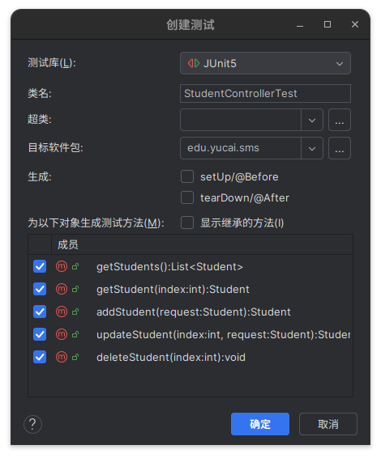

# 单元测试

在上一章中，我们已经创建了一个似乎有点像样的接口，并且执行了 HTTP 请求进行了测试，之后我们会不断的扩充这个项目的功能。这样我们就必然要不断的对功能进行测试，手动执行 HTTP 请求会浪费大量的时间，为了减少测试的工作量，我们可以使用 SpringBootTest 编写单元测试。

在之前创建的项目中的 build.gradle 配置中包含了`testImplementation 'org.springframework.boot:spring-boot-starter-test'`依赖项，这就是 Spring 给我们准备好的用来编写单元测试的工具。

## 创建测试类

光标选中 StudentController，同时按住 Alt 和 Enter，在弹出的快捷菜单中选择创建测试类，选中所有方法，点击确认。



IDEA 会帮你在 test/java/edu/yucai.sms 目录下创建测试类，按照我提供的内容编辑测试类。

```java
package edu.yucai.sms;

import org.junit.jupiter.api.MethodOrderer.OrderAnnotation;
import org.junit.jupiter.api.Order;
import org.junit.jupiter.api.Test;
import org.junit.jupiter.api.TestMethodOrder;
import org.springframework.beans.factory.annotation.Autowired;
import org.springframework.boot.test.autoconfigure.web.servlet.AutoConfigureMockMvc;
import org.springframework.boot.test.context.SpringBootTest;
import org.springframework.http.MediaType;
import org.springframework.test.web.servlet.MockMvc;

import static org.springframework.test.web.servlet.request.MockMvcRequestBuilders.*;
import static org.springframework.test.web.servlet.result.MockMvcResultMatchers.*;


@SpringBootTest
@AutoConfigureMockMvc
@TestMethodOrder(OrderAnnotation.class)
class StudentControllerTest {
    @Autowired
    MockMvc mockMvc;

    @Test
    @Order(1)
    void getStudents() throws Exception {
        mockMvc.perform(get("/students"))
                .andExpect(status().isOk())
                .andExpect(content().contentType(MediaType.APPLICATION_JSON))
                .andExpect(jsonPath("$").isArray())
                .andExpect(jsonPath("$").isEmpty());
    }

    @Test
    @Order(2)
    void getStudent() throws Exception {
        mockMvc.perform(get("/students/0"))
                .andExpect(status().isOk())
                .andExpect(content().contentType(MediaType.APPLICATION_JSON))
                .andExpect(jsonPath("$").isMap())
                .andExpect(jsonPath("$.name").isString())
                .andExpect(jsonPath("$.gender").isString())
                .andExpect(jsonPath("$.age").isNumber());
    }

    @Test
    @Order(2)
    void addStudent() throws Exception {
        mockMvc.perform(post("/students")
                        .contentType(MediaType.APPLICATION_JSON)
                        .content("""
                                {"name": "王刚", "gender": "男", "age": 12}
                                """))
                .andExpect(status().isOk())
                .andExpect(jsonPath("$").isMap())
                .andExpect(jsonPath("$.name").value("王刚"))
                .andExpect(jsonPath("$.gender").value("男"))
                .andExpect(jsonPath("$.age").value(12));
    }

    @Test
    @Order(4)
    void updateStudent() throws Exception {
        mockMvc.perform(put("/students/0")
                        .contentType(MediaType.APPLICATION_JSON)
                        .content("""
                                {"name": "李华", "gender": "男", "age": 12}
                                """))
                .andExpect(status().isOk())
                .andExpect(jsonPath("$").isMap())
                .andExpect(jsonPath("$.name").value("李华"))
                .andExpect(jsonPath("$.gender").value("男"))
                .andExpect(jsonPath("$.age").value(12));
    }

    @Test
    @Order(5)
    void deleteStudent() throws Exception {
        mockMvc.perform(delete("/students/0"))
                .andExpect(status().isOk());
    }
}
```

### 使用 IntelliJ IDEA 图形界面执行单元测试

#### **一、执行单个单元测试（以 StudentControllerTest 为例）**

1. **定位测试类或方法**  
   在 Project 窗口中，找到测试类（如`StudentControllerTest.java`），展开类文件查看测试方法（如`testGetStudents()`）。

2. **运行单个测试方法**

   - 鼠标悬停在测试方法名上，左侧会出现绿色三角形图标 ，点击即可执行该方法。
   - 或右键点击方法名，选择 **Run 'testMethodName'**（例如`Run 'testGetStudents'`）。

3. **运行整个测试类**
   - 点击测试类名左侧的绿色三角形图标 ，或右键点击类名，选择 **Run 'StudentControllerTest'**。

#### **二、通过 Gradle 执行整个项目的单元测试**

1. **打开 Gradle 工具窗口**

   - 点击 IDE 右侧的 **Gradle** 标签（若未显示，可通过菜单 **View > Tool Windows > Gradle** 打开）。

2. **定位测试任务**  
   在 Gradle 窗口中，展开项目节点 → `tasks` → `verification`，找到 `test` 任务（该任务会执行所有单元测试）。

3. **执行测试任务**
   - 双击 `test` 任务，IDEA 会自动调用 Gradle 执行测试，并在底部的 **Run** 窗口显示结果。
   - 或右键点击 `test` 任务，选择 **Run 'test'**。

#### **三、查看测试结果**

1. **单个测试结果**  
   执行后，底部 **Run** 窗口会显示测试状态：

   - 绿色对勾 ✅ 表示测试通过；
   - 红色叉号 ❌ 表示测试失败，点击可查看详细错误信息（如断言失败的预期值与实际值）。

2. **Gradle 测试结果**  
   执行`test`任务后，除了在 Run 窗口显示日志，还会生成测试报告：
   - 报告路径：`项目根目录/build/reports/tests/test/index.html`，双击可在 IDE 中打开可视化报告。

#### **四、常用快捷键（Windows/macOS）**

- 运行当前测试方法：`Alt+Shift+F10`（Windows） / `Control+Shift+R`（macOS）。
- 调试测试方法：`Alt+Shift+F9`（Windows） / `Control+Shift+D`（macOS）。

#### **五、图形界面操作示意图**

1. **运行单个测试方法**  
   

2. **运行 Gradle 测试任务**  
   

## 测试代码解释

### 一、测试类整体结构与注解

```java
@SpringBootTest
@AutoConfigureMockMvc
@TestMethodOrder(OrderAnnotation.class)
class StudentControllerTest {
    @Autowired
    MockMvc mockMvc;
    // 测试方法...
}
```

- **`@SpringBootTest`**：标记这是一个 Spring Boot 测试类，会加载完整的 Spring 应用上下文，用于集成测试。
- **`@AutoConfigureMockMvc`**：自动配置 MockMvc 实例，用于模拟 HTTP 请求，无需启动真实服务器。
- **`@TestMethodOrder(OrderAnnotation.class)`**：指定测试方法按`@Order`注解的顺序执行（默认按方法名排序）。
- **`@Autowired MockMvc mockMvc`**：注入 MockMvc 实例，用于发送 HTTP 请求并验证响应。

### 二、测试方法详细解析

#### 1. 获取学生列表测试（`getStudents`）

```java
@Test
@Order(1)
void getStudents() throws Exception {
    mockMvc.perform(get("/students"))
            .andExpect(status().isOk())
            .andExpect(content().contentType(MediaType.APPLICATION_JSON))
            .andExpect(jsonPath("$").isArray())
            .andExpect(jsonPath("$").isEmpty());
}
```

- **测试逻辑**：访问`/students`接口，验证返回结果。
- **关键步骤**：
  - `mockMvc.perform(get("/students"))`：发送 GET 请求到`/students`路径。
  - `status().isOk()`：验证响应状态码为 200（OK）。
  - `contentType(MediaType.APPLICATION_JSON)`：验证响应内容类型为 JSON。
  - `jsonPath("$").isArray()`：验证根响应是一个数组。
  - `jsonPath("$").isEmpty()`：验证数组为空（初始状态）。

#### 2. 获取单个学生测试（`getStudent`）

```java
@Test
@Order(2)
void getStudent() throws Exception {
    mockMvc.perform(get("/students/0"))
            .andExpect(status().isOk())
            .andExpect(content().contentType(MediaType.APPLICATION_JSON))
            .andExpect(jsonPath("$").isMap())
            .andExpect(jsonPath("$.name").isString())
            .andExpect(jsonPath("$.gender").isString())
            .andExpect(jsonPath("$.age").isNumber());
}
```

- **测试逻辑**：访问`/students/0`接口，验证返回单个学生对象的结构。
- **关键断言**：
  - `jsonPath("$").isMap()`：验证根响应是一个对象（Map）。
  - `jsonPath("$.name").isString()`：验证`name`字段是字符串类型。
  - 同理验证`gender`（字符串）和`age`（数字）字段的类型。

#### 3. 添加学生测试（`addStudent`）

```java
@Test
@Order(3)
void addStudent() throws Exception {
    mockMvc.perform(post("/students")
                    .contentType(MediaType.APPLICATION_JSON)
                    .content("""
                            {"name": "王刚", "gender": "男", "age": 12}
                            """))
            .andExpect(status().isOk())
            .andExpect(jsonPath("$").isMap())
            .andExpect(jsonPath("$.name").value("王刚"))
            .andExpect(jsonPath("$.gender").value("男"))
            .andExpect(jsonPath("$.age").value(12));
}
```

- **测试逻辑**：发送 POST 请求添加学生，验证响应和数据正确性。
- **请求构造**：
  - `contentType(MediaType.APPLICATION_JSON)`：设置请求体为 JSON 格式。
  - `content(...)`：传入 JSON 格式的学生数据。
- **响应验证**：
  - `jsonPath("$.name").value("王刚")`：验证返回的学生姓名与请求一致。
  - 同理验证性别和年龄字段的值。

#### 4. 更新学生测试（`updateStudent`）

```java
@Test
@Order(4)
void updateStudent() throws Exception {
    mockMvc.perform(put("/students/0")
                    .contentType(MediaType.APPLICATION_JSON)
                    .content("""
                            {"name": "李华", "gender": "男", "age": 12}
                            """))
            .andExpect(status().isOk())
            .andExpect(jsonPath("$").isMap())
            .andExpect(jsonPath("$.name").value("李华"))
            .andExpect(jsonPath("$.gender").value("男"))
            .andExpect(jsonPath("$.age").value(12));
}
```

- **测试逻辑**：发送 PUT 请求更新 ID 为 0 的学生，验证数据是否正确更新。
- **核心差异**：
  - 使用`put("/students/0")`请求更新指定学生。
  - 验证返回的学生姓名从"王刚"变为"李华"。

#### 5. 删除学生测试（`deleteStudent`）

```java
@Test
@Order(5)
void deleteStudent() throws Exception {
    mockMvc.perform(delete("/students/0"))
            .andExpect(status().isOk());
}
```

- **测试逻辑**：发送 DELETE 请求删除学生，验证操作是否成功。
- **简洁验证**：仅验证响应状态码为 200（OK），因为删除操作通常不返回内容。

### 三、关键技术点说明

1. **测试顺序控制**

   - 通过`@Order`注解指定执行顺序（1-5），确保测试按逻辑流程执行（先获取、再添加、更新、删除）。
   - 注意：实际开发中应尽量避免测试顺序依赖（如本例依赖数据状态），理想情况下每个测试应独立。

2. **JSON 路径断言（jsonPath）**

   - `$`：表示 JSON 根节点。
   - `$.name`：访问 JSON 对象中的`name`字段。
   - `isArray()`/`isMap()`：验证数据类型。
   - `value("王刚")`：验证字段值是否等于预期。

3. **MockMvc 请求构造**

   - `get()/post()/put()/delete()`：创建不同类型的 HTTP 请求。
   - `contentType()`：设置请求头的 Content-Type。
   - `content()`：设置请求体内容（JSON 格式）。

4. **响应验证链**
   - `andExpect()`方法可链式调用多个断言，清晰表达验证逻辑。
   - 常用断言：状态码、内容类型、JSON 结构、字段值等。

### 四、最佳实践与改进建议

1. **测试独立性**

   - 当前测试依赖执行顺序（如删除操作依赖之前的添加操作），建议在每个测试前重置数据（如通过`@BeforeEach`初始化学生列表）。

2. **边界条件测试**

   - 补充对非法输入的测试（如空姓名、负数年龄、不存在的学生 ID）。

3. **断言优化**

   - 对于复杂 JSON 结构，可使用`jsonPath("$", hasSize(1))`等集合断言，或自定义匹配器提升可读性。

4. **异常处理测试**
   - 添加对异常场景的测试（如网络错误、权限拒绝），验证接口返回正确的错误状态码和信息。

通过这套测试用例，可全面验证 StudentController 接口的 CRUD 功能，确保代码在各种场景下的正确性。测试框架的自动化执行能力也为后续代码迭代提供了可靠的保障。
